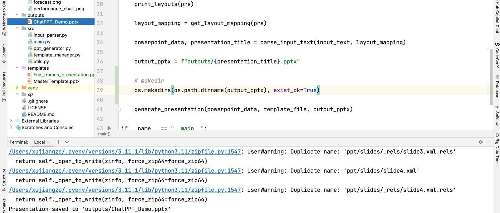

# 作业链接
https://u.geekbang.org/lesson/656?article=817221

# 要求
下载微软官方发布的 PPT 母版文件 Fair frames presentation.pptx （在附件中下载，或者访问网址  https://create.microsoft.com/en-us/template/fair-frames-presentation-129d8740-bc48-481e-b35c-22d35c3e308b
下载） ，学习和掌握 PPT 母版相关概念。
使用 Fair frames presentation.pptx 中的布局替换 ChatPPT v0.1 的布局名称，并生成 PPT 文件，查看内容与布局是否匹配。

# 作业解析
1. 下载微软官方发布的 PPT 母版文件 Fair frames presentation.pptx
点击下载即可
2. 学习和掌握 PPT 母版相关概念
略
3. 使用 Fair frames presentation.pptx 中的布局替换 ChatPPT v0.1 的布局名称，并生成 PPT 文件，查看内容与布局是否匹配
将文件下载后放置在templates目录下
4. 修改main.py文件
25行
```python
# 替换如下
template_file = 'templates/MasterTemplate.pptx'
# 为
template_file = 'templates/Fair_frames_presentation.pptx'
```

5. 运行main.py文件
```shell
python main.py
```

6.运行截图

替换后结果ppt
