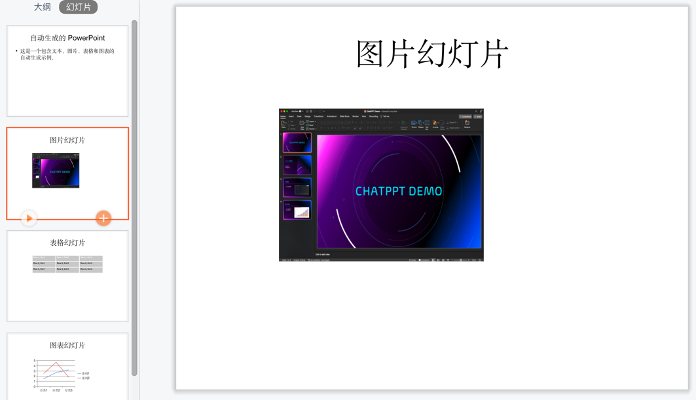

# 作业链接
https://u.geekbang.org/lesson/656?article=818080

# 作业描述
1.使用 python-pptx 自动生成 PowerPoint 文件，内容包括文本、图片、表格和图表 。

2.使用 Gradio 搭建一个 ChatBot 作为图形化用户界面（GUI），支持将用户输入转换为 ChatPPT PowerPoint 标准输入格式（Markdown），并最终生成 PowerPoint 文件。

ChatBot System Prompt 可使用 ChatPPT v0.2 prompts/formatter.txt 文件，鼓励自行创作和优化。
【可选】将 ChatBot 生成 Markdown 和 ChatPPT v0.2 的主流程整合，支持聊天输入，自动生成 PowerPoint 文件作为输出。

# 作业解析
## 1. 使用 python-pptx 自动生成 PowerPoint 文件, 内容包括文本、图片、表格和图表 。
- 思路: 需要先自主学习 jupyter/pptx_quickstart.ipynb, 了解 python-pptx 的基本使用方法。
- 参考资料: [python-pptx 官方文档](https://python-pptx.readthedocs.io/en/latest/index.html)

- 作业示例
```bash
# 安装 python-pptx
pip install python-pptx
```
详细代码如下
ps: 可通过打开母版来进行优化.
这里仅做基础的演示.
```python
from pptx import Presentation
from pptx.util import Inches, Pt
from pptx.enum.shapes import MSO_SHAPE
from pptx.dml.color import RGBColor
from pptx.chart.data import CategoryChartData
from pptx.enum.chart import XL_CHART_TYPE


# 创建演示文稿对象
prs = Presentation()

# 1. 添加文本幻灯片
slide_layout = prs.slide_layouts[1]  # 选择标题和内容布局
slide = prs.slides.add_slide(slide_layout)
title = slide.shapes.title
title.text = "自动生成的 PowerPoint"
content = slide.placeholders[1]
content.text = "这是一个包含文本、图片、表格和图表的自动生成示例。"

# 2. 添加图片幻灯片
slide_layout = prs.slide_layouts[5]  # 选择只有标题的布局
slide = prs.slides.add_slide(slide_layout)
title = slide.shapes.title
title.text = "图片幻灯片"
img_path = '../images/chatppt_presentation_demo.png'  # 替换为实际图片路径
slide.shapes.add_picture(img_path, Inches(2), Inches(2), width=Inches(4), height=Inches(3))


# 3. 添加表格幻灯片
slide_layout = prs.slide_layouts[5]
slide = prs.slides.add_slide(slide_layout)
title = slide.shapes.title
title.text = "表格幻灯片"
rows, cols = 3, 3
left, top, width, height = Inches(2), Inches(2), Inches(6), Inches(1.5)
table = slide.shapes.add_table(rows, cols, left, top, width, height).table


# 填充表格内容
for row in range(rows):
    for col in range(cols):
        table.cell(row, col).text = f"Row {row+1}, Col {col+1}"

# 设置表格样式
for cell in table.iter_cells():
    cell.text_frame.paragraphs[0].font.size = Pt(12)
    cell.text_frame.paragraphs[0].font.bold = True
    cell.fill.solid()
    cell.fill.fore_color.rgb = RGBColor(200, 200, 200)


# 4. 添加图表幻灯片
slide_layout = prs.slide_layouts[5]
slide = prs.slides.add_slide(slide_layout)
title = slide.shapes.title
title.text = "图表幻灯片"

# 创建图表数据
chart_data = CategoryChartData()
chart_data.categories = ["分类1", "分类2", "分类3"]
chart_data.add_series("系列1", (1.5, 2.7, 3.2))
chart_data.add_series("系列2", (2.5, 4.7, 1.8))

# 创建图表数据
chart_data = CategoryChartData()
chart_data.categories = ["分类1", "分类2", "分类3"]
chart_data.add_series("系列1", (1.5, 2.7, 3.2))
chart_data.add_series("系列2", (2.5, 4.7, 1.8))

# 添加图表
x, y, cx, cy = Inches(2), Inches(2), Inches(5), Inches(3)
chart = slide.shapes.add_chart(
    XL_CHART_TYPE.LINE, x, y, cx, cy, chart_data
).chart

# 保存 PowerPoint 文件
prs.save('../outputs/generated_presentation.pptx')

```

- 效果展示



## 作业2. 使用 Gradio 搭建一个 ChatBot 作为图形化用户界面（GUI），支持将用户输入转换为 ChatPPT PowerPoint 标凇输入格式（Markdown），并最终生成 PowerPoint 文件。
- 思路: 修改老师的代码, 使用gradio搭建一个简单的图形化界面用于交互和生成.
- 执行步骤
  - 先预执行老师的代码, 了解老师的代码构成
在根目录下执行.
```bash
python src/chatbot.py
```
