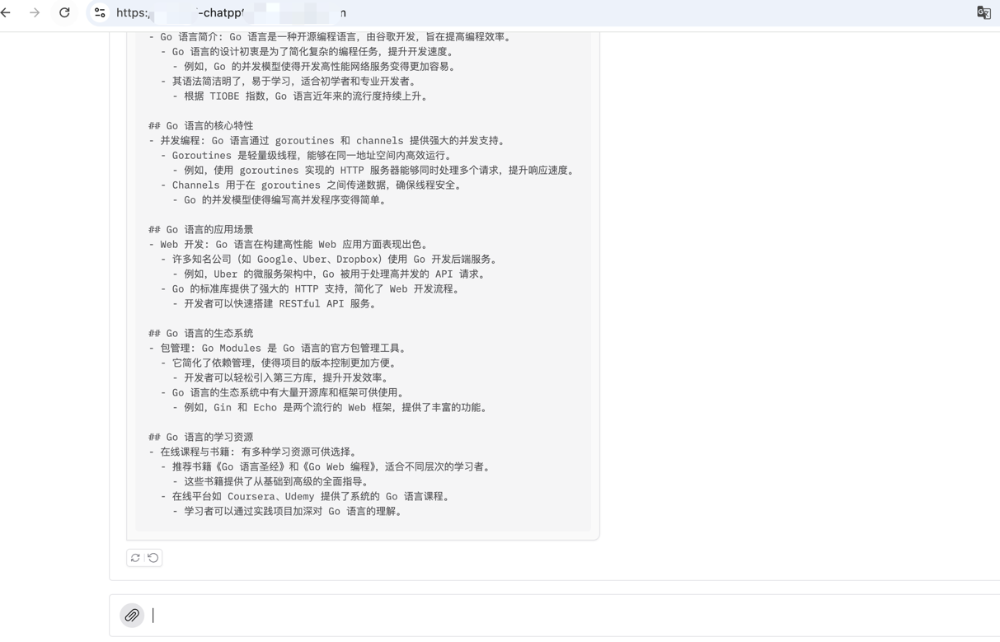

# 作业链接
https://u.geekbang.org/lesson/656?article=819968

# 作业内容
将 ChatPPT 发布为 HTTPS 服务（IP：PORT 形式访问），提交截图。
【可选】使用你的域名来发布 ChatPPT 服务，提交服务链接。


# 作业解析
安装nginx，配置ssl证书，配置nginx，启动nginx，访问https://ip:port，截图。

## 安装nginx
通过已经准备好的package来进行安装
推荐在虚拟机上进行
```shell
cd homework/package
sudo mkdir /usr/local/src
cp * /usr/local/src
cd /usr/local/src
bash install install_nginx.sh

```
## 申请ssl证书
[申请ssl证书](../docs/proxy.md)

## 是否需要dns证书解析?
不一定, 可以通过配置etc/hosts来实现
当然正式下还是需要去申请的, 测试过程中可以直接通过 /etc/hosts绑定来实现
eg: 域名
www.test.com 希望绑定到127.0.0.1
```bash 
sudo echo "127.0.0.1 www.test.com" >> /etc/hosts
```


## 在测试机器上通过docker-compose启动
```bash
# 将本项目拷贝到机器上

# 配置环境变量
export OPENAI_API_KEY=你的sk
export OPENAI_API_BASE=你的代理

# 后台启动程序
# 其中需要修改代码适配外部配置环境. 通过.env和docker-compose.yaml来实现
docker-compose up -d
```


## 配置nginx
参考老师的nginx文档
[申请ssl证书](../docs/proxy.md)

## 配置完reload一下
```bash
# 检查
/usr/local/nginx/nginx -t
# reload
/usr/local/nginx/nginx -s reload
```

## 访问
效果如下图
